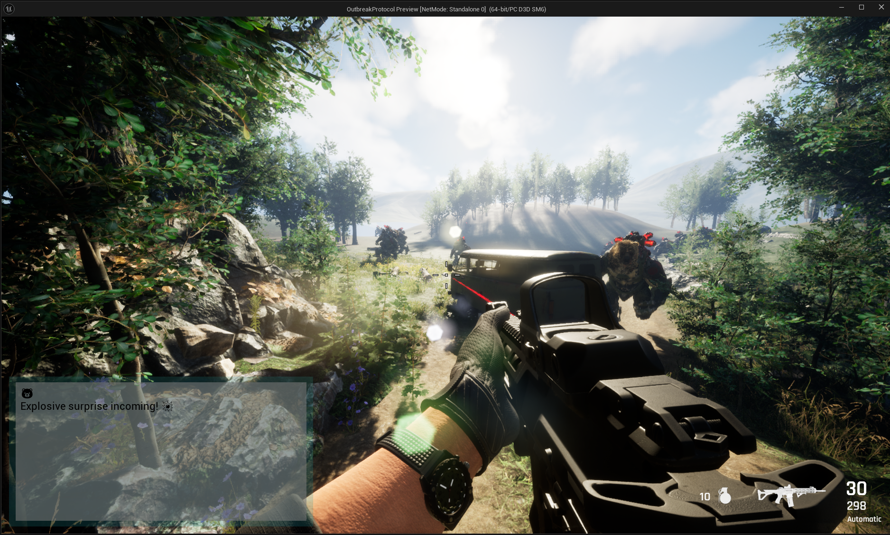
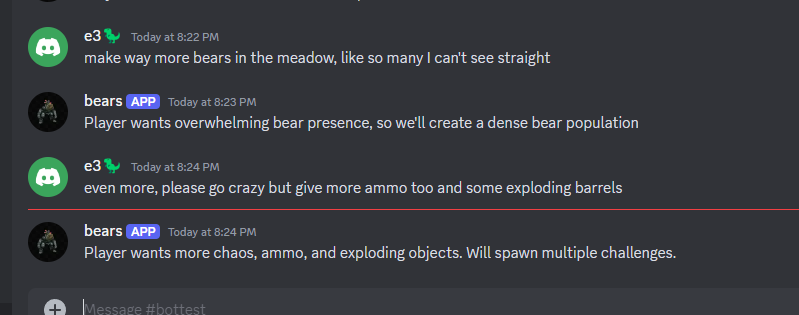
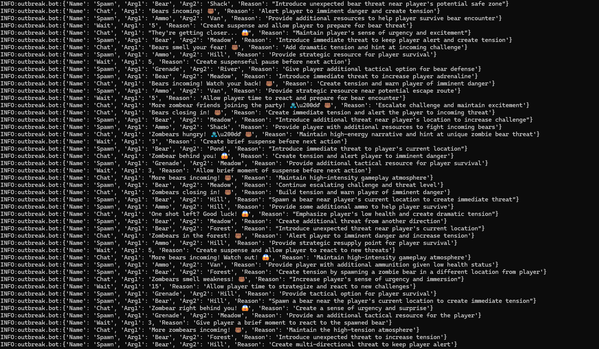

# Outbreak Protocol (WIP) AWS Hackathon

A zombie-inspired FPS where deadly bears meet emergent, AI-driven chaos.


*"make way more bears in the meadow, like so many I can't see straight"*

What makes this game unique? Using [Claude Haiku](https://www.anthropic.com/claude/haiku) an LLM takes control of managing events in game while taking input from friends on Discord.




Created for the [AWS Game Builder Challenge '24](https://awsdevchallenge.devpost.com/). Please do not use any of this code in production, it was for a hackathon.

## How It Works


Behind the scenes, Outbreak Protocol is powered by these AWS services that bring the chaos to life:

1. **Amazon Bedrock**
    * Powers the Retrieval-Augmented Generation (RAG) system that processes natural language discussions and converts them into actionable in-game events.
    * What this means: Your friends casually chat with the bot, whether conspiring to “make things harder” or “summon more bears”, and the bot will interpret these ideas to create dynamic and emergent gameplay scenarios.
1. **Amazon GameLift**
    * Dedicated game servers to ensure smooth gameplay and persistent bear threats.
1. **Amazon EKS**
    * Hosts the Discord bot in a dedicated Kubernetes cluster for optimal performance.
    * What this means: All interactions with the bot are processed in real time, enabling fast responses to player conversations.

## Gameplay Features


### AI-Driven Chaos



There aren't scripted interactions, instead a set of actions are available to the LLM to choose how to script fun into the scene.

```json
{"Name": "Wait", "Arg1": "Amount of time to wait in seconds", "Reason": "Reason why to do this action."}
{"Name": "Chat", "Arg1": "Very short (under 30 character), sarcastic message to send to the player, can rarely include emojis but keep trying different emojis", "Reason": "Reason why to do this action."}
{"Name": "Spawn", "Arg1": "Object friendly name (Bear, GasCan, Ammo, Grenade, Toilet)", "Arg2": "Location friendly name (Pond, Van, Meadow, Hill, River)", "Reason": "Reason why to do this action."}
{"Name": "MoveTo", "Arg1": "Object ID", "Arg2": "Location friendly name (Pond, Van, Meadow, Hill, River)", "Reason": "Reason why to do this."}
{"Name": "TeleportPlayer", "Arg1": "Player", "Arg2": "Location friendly name (Pond, Van, Meadow, Hill, River), do not use too often.", "Reason": "Reason why to do this."}
```

### Emergent Behavior


Thanks to the RAG-based bot (**note**: the hackathon doesn't use a RAG), the game evolves organically. Friends can collaborate with the bot to create chaos!

## Technical Details


The Outbreak Protocol was built using the following AWS services:

1. **Amazon Bedrock**: Enables natural language processing via RAG technology, converting conversations into emergent in-game behavior.
1. **Amazon GameLift**: Dedicated game server support for reliable and scalable gameplay.
1. **Amazon EKS**: Ensures high availability and performance for the Discord bot.

### Fantastic UE5 Samples Used
* [Realistic Assault Rifle Template](https://www.fab.com/listings/05dbb53b-d75f-4a08-bcc2-fc02de484866)
* [Meadow - Environment Set](https://www.fab.com/listings/4f61d2d7-8d6f-4817-890d-17a6ba2287af)
* [Post Soviet Bathroom](https://www.fab.com/listings/f3964980-8332-414a-9e92-0d172d3a235c)
* [Post-Soviet Village](https://www.fab.com/listings/214992bc-8f89-4823-ab14-3ac2dd131e91)
* [Paragon: Boris](https://www.fab.com/listings/2e32cbb8-b415-4c39-962f-a687c64263bd)
* [Realistic Starter VFX Pack Vol 2](https://www.fab.com/listings/ac2818b3-7d35-4cf5-a1af-cbf8ff5c61c1)
* [Environment SFX from Artlist](https://artlist.io/)

## How to Play

Spawn in the toilet and enter the chaotic meadow filled with deadly zombie bears.

Add the custom Discord bot to your Discord server. Let your friends chat naturally with it to create chaos.

Avoid bears, dodge explosions, and watch as your friends’ conversations lead to unexpected gameplay twists.

## What Makes This Unique?
* **Emergent Gameplay**: No two playthroughs are the same. The AI adapts to player interactions, creating unpredictable and memorable moments.
* **Cutting-Edge Technology**: Powered by Amazon Bedrock’s RAG capabilities, the bot pushes the boundaries of traditional game mechanics by enabling AI-driven chaos.
* **Natural Language Interaction**: The bot interprets your friends’ casual conversations to create dynamic in-game events, from summoning new threats to modifying bear behavior.

Explore Outbreak Protocol and see how AWS services power the perfect blend of survival horror and AI-driven chaos.